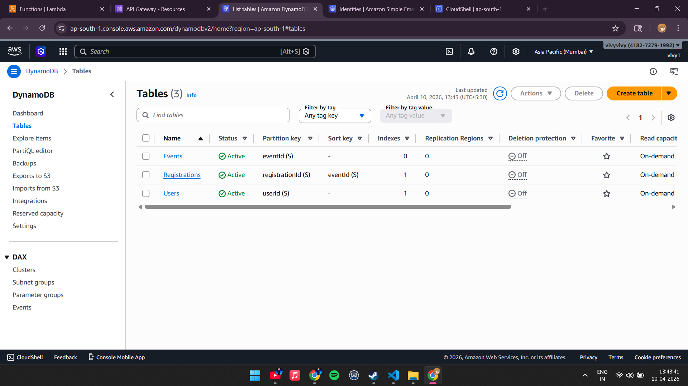
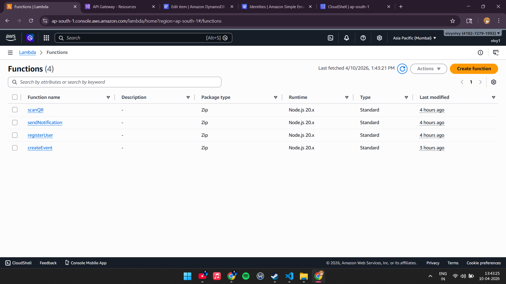
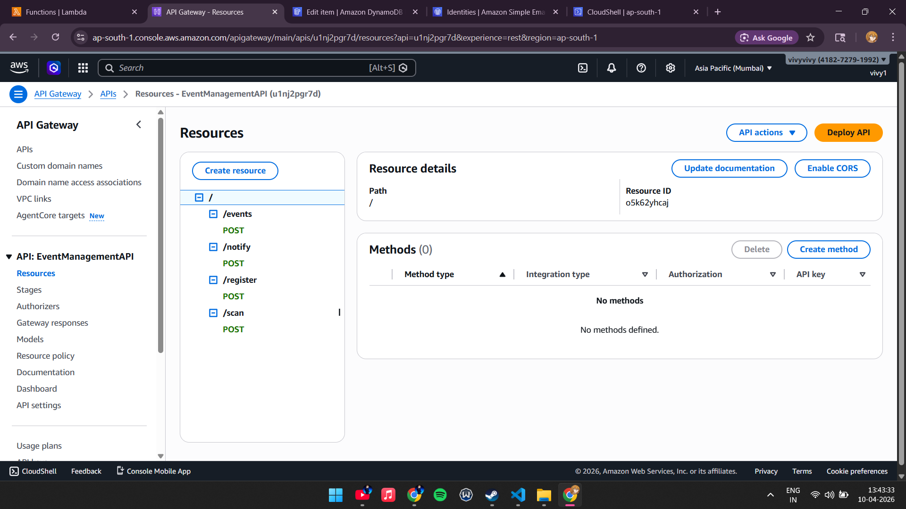
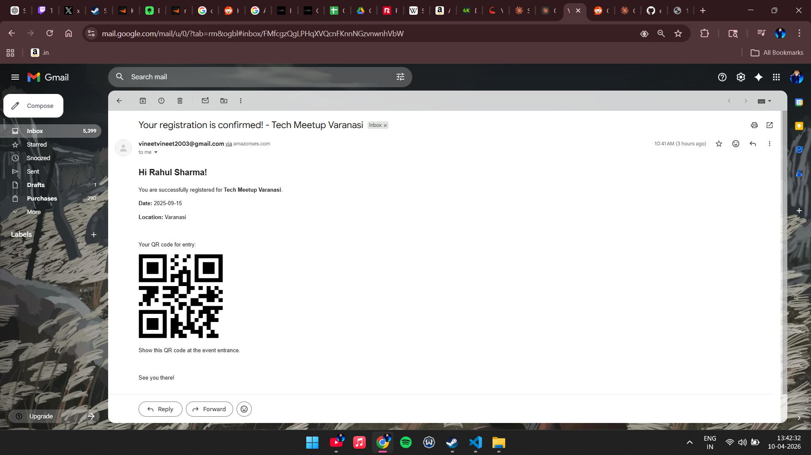

# Serverless Event Management System

A fully serverless cloud-based system to manage events and registrations, built on AWS.

## Architecture

- **AWS Lambda** — Business logic (4 functions)
- **API Gateway** — REST API endpoints
- **DynamoDB** — NoSQL database
- **Amazon SES** — Email notifications
- **QR Code** — Registration tracking via QR images

## Live API
https://u1nj2pgr7d.execute-api.ap-south-1.amazonaws.com/prod

## API Endpoints

| Method | Endpoint | Description |
|--------|----------|-------------|
| POST | /events | Create a new event |
| POST | /register | Register a user for an event |
| POST | /scan | Check in attendee via QR code |
| POST | /notify | Send confirmation email with QR code |

## How it works

1. Organiser creates an event via POST /events
2. User registers via POST /register and gets a unique QR code
3. Confirmation email is sent via POST /notify with QR code attached
4. At the event door, QR is scanned via POST /scan and attendee is marked as checked in

## Screenshots

### DynamoDB Tables

### Lambda Functions

### API Gateway Routes

### Email Notification with QR Code

## Tech Stack

- Node.js 20.x
- AWS Lambda
- AWS API Gateway
- AWS DynamoDB
- AWS SES
- AWS CloudShell
- GitHub